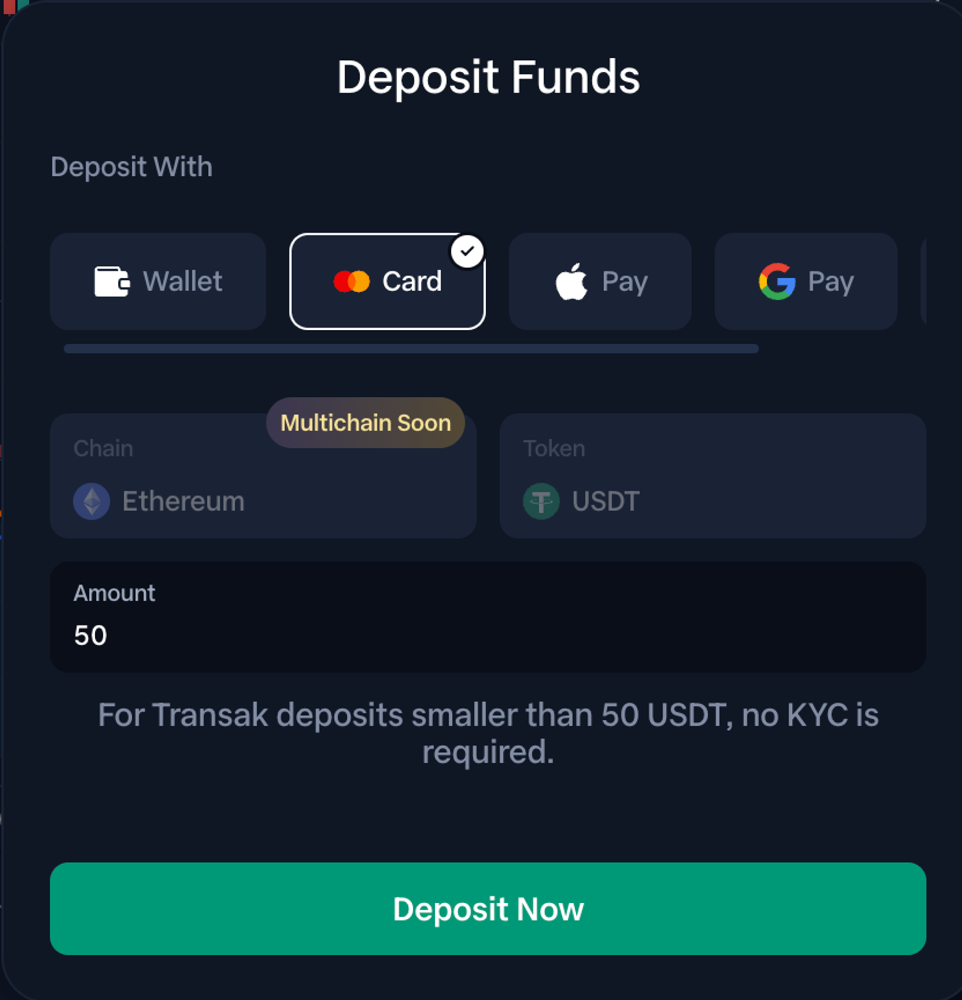

# Chart Trader

Powerful & perfect for your most demanding users. Carefully engineered with active traders in mind. Full-fledged technical analysis with trading capabilities. Visual trading at its finest makes it easy for users to take action quickly. Portfolio monitoring, point & click order adjustments and intuitive all around.

Gone are the days of navigating through multiple screens and windows to execute your trades. That horrible feeling of missing a trade because you were too slow to place an order. With Chart Trader, you now have the convenience and efficiency of making instant trading decisions right from the chart.&#x20;

Here's how Chart Trader can transform your trading experience:

1️⃣ Visualize and Strategize: With Chart Trader, you can effortlessly visualize where to place your orders on the chart. By simply right-clicking on the chart, you can now initiate trades with precision and confidence. 🎯

<figure><figcaption></figcaption></figure>

2️⃣ Amend Orders with Ease: Experience the freedom to adapt to market changes swiftly. Chart Trader allows you to easily amend your buy and sell orders by dragging and dropping them on the chart. Seamlessly adjust your positions to align with your evolving trading strategies. ⚙️💼

<figure><figcaption></figcaption></figure>

3️⃣ Cancel Orders Instantly: No more hassle or time wasted on canceling orders. Chart Trader lets you cancel orders directly from the chart, making it quick and effortless to manage your trading activity. 🚫❌

<figure><figcaption></figcaption></figure>

4️⃣ Position Entry Price and Size: Gain a comprehensive overview of your positions without leaving the chart. With Chart Trader, you can see your position entry price and size directly from the chart itself. Stay informed and make well-informed trading decisions based on real-time data. 💹📊

5️⃣ Long and Short Indicators: Never lose track of your trading positions again. Chart Trader provides clear and concise indicators on the chart, highlighting where you entered long and short positions. Effortlessly identify your trades and manage them effectively to maximize your profitability. 🔍📈

**Here are some testimonials from RabbitX users who are already using Chart Trader:**

* "RabbitX Chart Trader is a game-changer. I can now place, cancel, and amend orders quickly and easily, which has helped me improve my trading performance."
* "I'm a beginner trader, and Chart Trader has made it so much easier for me to understand the market and make trading decisions by looking at the chart."
* "Chart Trader is the best trading tool I've ever used. It's so intuitive and easy to use, and it's helped me take my trading to the next level”

We believe that Chart Trader will be a game-changer in how you approach and execute your trades. It streamlines the trading process, empowering you to focus on what really matters: making profitable decisions in the market.&#x20;

Stay ahead of the game and maximize your trading potential with Chart Trader. We can't wait to see how this feature elevates your trading strategies and brings you closer to your financial goals.&#x20;

Trade smarter, trade faster, trade like never before with Chart Trader! 📈🚀

Chart Trader is available to all RabbitX users today! To start using the Chart Trader, visit the [trading page](https://app.rabbitx.io).

