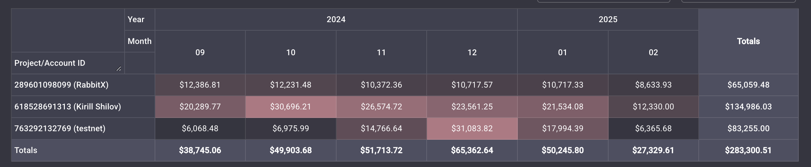

# Deposit / Withdrawal

## Deposit

Deposits on RabbitX are done on Ethereum layer 1. RabbitX then uses Starknet for our settlement service to handle your deposits and withdrawals. Using our L1 <> L2 link, we conveniently take care of all the backend processes for you.

So even though you're depositing on Ethereum, you're still using Starknet layer 2.

Note: RabbitX only accepts **ERC-20 USDT on Ethereum** as deposits. Sending any other coins will result in irretrievable lost coins.

<figure><figcaption>
Step 1. Connect your wallet
</figcaption></figure>

.png>).png>)

<figure><figcaption>
Deposits and withdrawals are shown in "Transfers"
</figcaption></figure>

Deposits require at least 16 on-chain confirmations. Deposits typically take **3-6 minutes.** Reach out to our discord [support channel](https://discord.gg/yFHNDe4KDY) if you have any issues during the deposit process.

## Withdrawal

Once a withdrawal request has been initiated and ready to be claimed, it will be shown in the "Transfers" tab.

Please note the process for withdrawals:

* Your wallet balance on RabbitX will be immediately deducted by the withdrawn amount
* You will see the withdrawn amount display initially as “Pending” in your Transfers tab
* Once the withdrawal is ready to be claimed, the status will be "Claimable"
* You will be able to claim your withdrawal by clicking the "Claim" button
* Once completed, the transfer status will change to “Success” in your Transfers tab
* You are able to cancel your withdrawal at any step before executing the "Claim" transaction. Once "Claim" has been executed, you must wait for the transaction to be mined by the Ethereum blockchain.

Withdrawals are a two-step process. In order to complete a withdrawal, users must claim their withdrawal from "Transfers".

<figure><figcaption></figcaption></figure>

<figure><figcaption></figcaption></figure>

Safety and security is the highest priority for RabbitX. For security, we require more block time process larger withdrawal transactions based on the withdrawal amounts below.

| Withdrawal Amount | Processing Blocks |
| ----------------- | ----------------- |
| 0-9,999           | 1 (10-20s)        |
| 10,000-99,999     | 10 (1.5 - 3mins)  |
| 100,000-999,999   | 100 (20 - 40mins) |
| 1,000,000+        | 1800 (6hrs)       |

Reach out to our [discord channel](https://discord.com/invite/rabbitx) if you have any issues during the withdrawal process.
