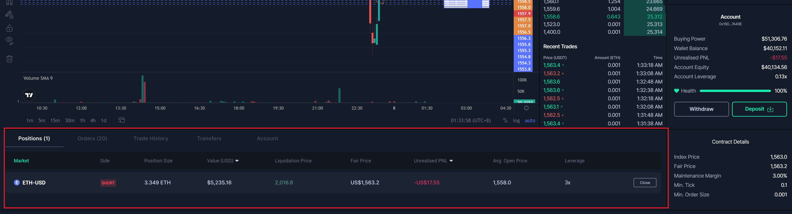

# FAQ

### What are ZK Rollups?

ZK Rollups refers to zero-knowledge rollups, a concept conceived of in 1985 and now the premiere and best means of scaling Ethereum. ZK rollups are a hybrid scaling solution on Ethereum mainnet that increase throughput and lowers transaction costs. **ZK-rollups** bundle (or 'roll up') transactions into batches that are executed offchain. Offchain computation reduces the amount of data that has to be posted to the blockchain. ZK-rollup operators submit a summary of the changes required to represent all the transactions in a batch rather than sending each transaction individually.&#x20;

### What is Starknet?

Starknet is an open, decentralized, scaling solution for Ethereum. It enables any decentralized application to achieve unlimited scale -- without compromising on security, composability, speed, and integrity.&#x20;

### Wen token?

RBX token has been announced. The ERC20 contract address is `0x3Ba925fdeAe6B46d0BB4d424D829982Cb2F7309e` . Please read this twitter announcement for more details [https://twitter.com/rabbitx\_io/status/1651800369578790913](https://twitter.com/rabbitx\_io/status/1651800369578790913).

### Where can I find the Rabbit<mark style="color:red;">X</mark> API?

Trading APIs are available at [Broken link](broken-reference "mention")

### How did you come up with the name Rabbit<mark style="color:red;">X</mark>

RabbitX is fun and fast as hell. Also bunnies are adorable.

### What do I need to do to start trading?

Simply deposit through your wallet and you're ready to start trading!

### Can anyone trade?

Yes! As long as you have a wallet, you can deposit on the exchange and start trading. We're completely permissionless.

### Will there be a trader rewards program?

Yes. Coming soon :tm:

### Is there any airdrop?

Yes, read this [announcement ](https://twitter.com/rabbitx\_io/status/1641408506044780544)for details.

### Why am I experiencing "POST\_CHECK\_MARGIN" error?

Please read our [Margin Calculation ](margin-calculation.md#faq-why-cant-i-close-my-position-and-i-see-a-post-match-error)documentation for more details.

### Why am I experiencing "Ownership Verification Failed" error?

### &#x20;

This error could be due to an out of sync computer clock. Please try to sync your computer clock.

There are several ways to sync your computer clock. Here are a few methods:

On Windows: Right-click on the clock in the taskbar, select "Adjust date/time", then click "Sync now".&#x20;

On Mac: Click on the Apple menu, select "System Preferences", click "Date & Time", then click "Set date and time automatically".

### How does your liquidation engine work?

Rabbit<mark style="color:red;">X</mark> employs a partial liquidation strategy that minimizes the negative impact of liquidations on users. Check out this [link](liquidations.md) for more information.

### Why is my market order unfilled?

To protect traders from adverse price movements when executing a market order, if the execution price of a market order deviates beyond 5%, the exchange will automatically place the remaining unfilled portion of the order at 5% away from the fair price.

### What is market leverage?

You can choose different leverage for each market. For example, you can choose a market leverage of 20x for BTC-USD and a market leverage of 5x for ETH-USD. Your account leverage is your current account open positions notional / account equity. Market leverage is applied to your open positions and active orders in that market.

### What is withdrawable balance?

Withdrawable balance is the amount available for withdrawal. It is min(wallet balance, account equity) - order margin - position margin. You will not be able to place new orders if your withdrawable balance is 0.

### What are fair price and market price?

Fair price is the price used to mark your position unrealised pnl. Market price is the mid price between the current best bid and best offer.

### Why hasn't my withdrawal arrived yet?

Withdrawals may take up to **12 hours** to be confirmed from Starknet to Ethereum L1. Withdrawals are a two-step process. Once a withdrawal request has been processed and ready to be claimed, it will be shown in the "Transfers" tab.

<figure><figcaption></figcaption></figure>

Please note the process for withdrawals:

* Your wallet balance on RabbitX will be immediately deducted by the withdrawn amount
* You will see the withdrawn amount display initially as “Pending” in your Transfers tab
* Once the withdrawal is accepted by Starknet, the status will change to “Transferring”
* In “Transferring” status, your withdrawal is now being processed by Starknet. Depending on Starknet’s block time this process currently takes up to 12 hours, with an estimated time of 6-10 hours.
* You will then be able to claim your requested withdrawal amount back to your wallet. You must initiate the claim and sign the transaction from the "Transfers" tab.
