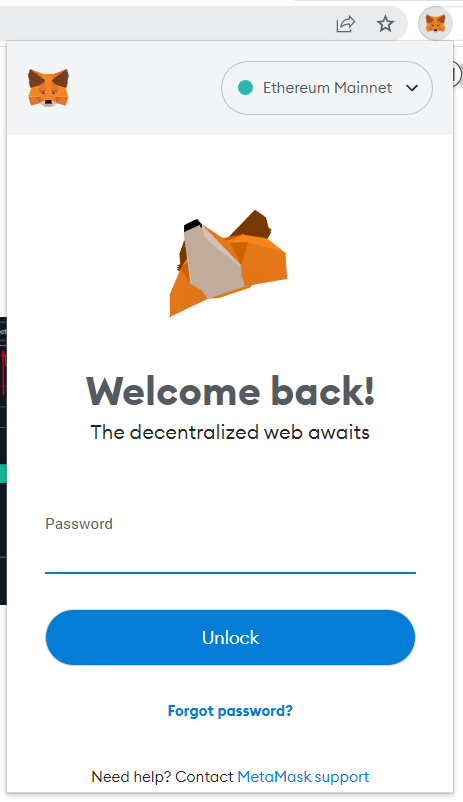
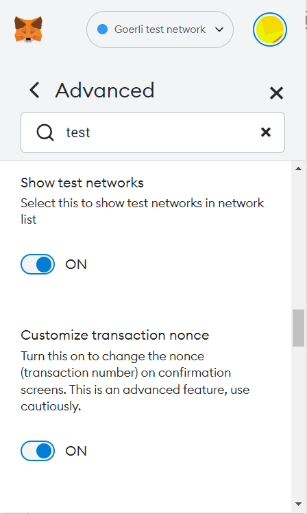
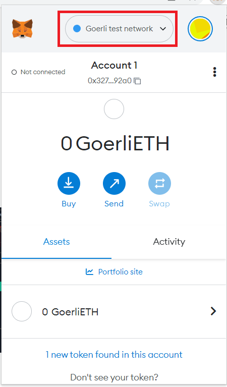
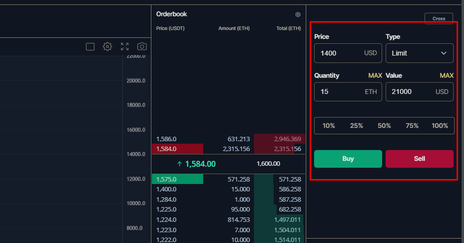
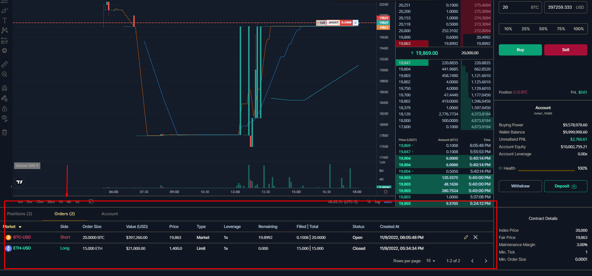

# Testnet

## Get Started

**Connecting:**

* Visit [https://testnet.rabbitx.io](https://testnet.rabbitx.io)
* Click the "Connect Wallet" button in upper-right corner:

<figure><figcaption></figcaption></figure>

 

<figure><figcaption></figcaption></figure>

 

<figure><figcaption></figcaption></figure>

 

<figure><figcaption></figcaption></figure>

* Connect your Metamask wallet > switch to "Goerli test network" > Sign and verify
* If you don't have a web3 wallet, you can download Metamask here [https://metamask.io/download/](https://metamask.io/download/)
* If you don’t see the Goerli test network, go to Metamask settings > "Show test networks" > ON

**Trading:**

* All testnet accounts start with $10M in USDT collateral to trade with.
* In the upper-right side, you will see parameters to send your order. There you can input your order type, limit price (if applicable), and the size of your trade.

<figure><figcaption></figcaption></figure>

**Reviewing your orders and order history:**

* At the bottom of the page you will see your completed and open orders under the Orders option
* Clicking the Positions tab will show your current positions on RabbitX
* Clicking the Account tab shows your account balances, margin requirement, PnL, leverage, and volume figures

<figure><figcaption></figcaption></figure>

## **FAQs**

**Q:** How do I deposit testnet collateral to start trading?

**A:** You don’t need to. All accounts start out with a $10M USDT balance to begin trading. For this reason, the Deposit function currently is not operational.

**Q:** How do I get gas to start trading?

**A:** You do not need testnet ETH to start trading. However if you try to use the Deposit/Withdraw feature for your USDT balance, you will need testnet ETH. We do not provide this since we are providing testnet USDT for you to trade on the RabbitX platform.

**Q:** Why am I interacting on an Ethereum testnest (Goerli) if you’re on Starknet?

**A:** You will be depositing and withdrawing on Ethereum L1 for RabbitX (even on mainnet). We then bridge to Starknet for you on the backend. This is why you can use an EVM wallet with us and don’t have to use a cairo-specific wallet like other ZK projects. Your trades are still occurring on Starknet, we’ve simply removed the hassle of bridging for you.

Since your interactions will be on Ethereum but your trades will be batched and occurring on Starknet, we're deployed on Goerli. but starknet tech is still being used.

**Q:** Why do my market orders sometimes not immediately fill?

**A:** Market orders are currently sent out as limits around the bid/ask price when you place new orders or when you close your positions. This may not be immediately marketable and if not it will not fill like a regular market order. The market order feature will be updated soon so it’s routed like a true market order. In the interim, to send out an order that can be filled immediately, please send a marketable limit order instead.

**Q:** Why am I seeing negative prices?

**A:** Our risk management engine is currently not integrated, hence you may see negative prices. This will be fixed once we integrate our risk management engine.

**Q:** Why can't I deposit / withdraw?

**A:** Deposits and withdrawals are currently disabled for testnet. Your account will have a $10M starting balance when you connect your wallet.
